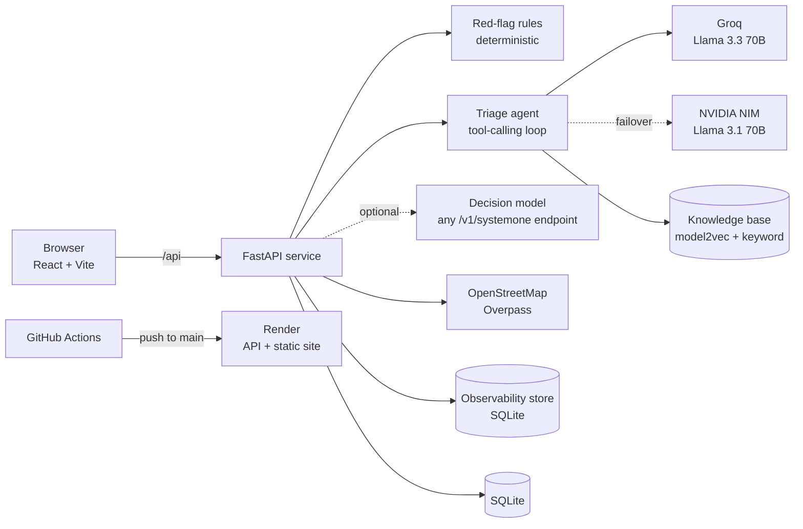
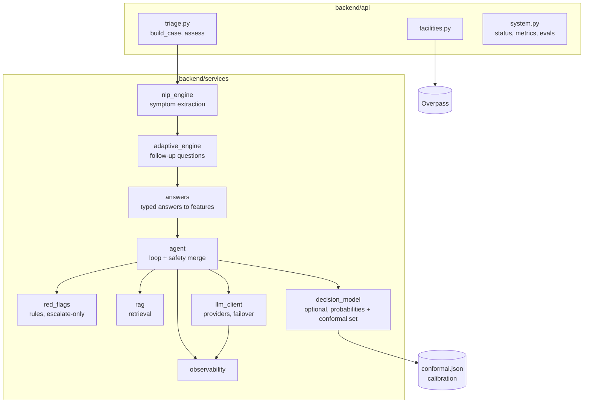
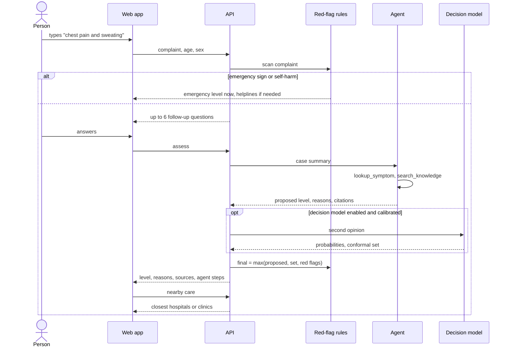

# HealthAI triage

**Describe your symptoms in your own words and get one of three levels (home care, see a doctor today, or emergency), the reasons behind it, cited sources, and real places nearby to get care.** The level comes from a tool-calling AI agent, but deterministic safety rules sit on top of it and can only raise the level, never lower it.

[](https://github.com/Asha0509/healthcare/actions/workflows/ci.yml)
[](https://github.com/Asha0509/healthcare/actions/workflows/quality.yml)
[](https://github.com/Asha0509/healthcare/actions/workflows/codeql.yml)
[](https://scorecard.dev/viewer/?uri=github.com/Asha0509/healthcare)

**Live:** https://healthai-triage.onrender.com · [Evals](https://healthai-triage.onrender.com/evals) · [Ops dashboard](https://healthai-triage.onrender.com/ops) · API docs at `https://healthai-triage-api.onrender.com/api/docs`

> Portfolio project, not a medical device. It can be wrong. In an emergency, call 112.

**Contents:** [Problem](#the-problem) · [Results](#results) · [Architecture](#architecture) · [User flow](#user-flow) · [How a case is decided](#how-a-case-is-decided) · [The second opinion](#the-second-opinion-an-optional-decision-model) · [Tools](#tools-and-why) · [CI/CD](#engineering-quality-and-cicd) · [Run it](#run-it) · [Limits](#limits)

## The problem

Someone with chest tightness at 2 a.m. has three options: search the web and read a list of frightening possibilities, wait until morning, or go to the hospital. Symptom checkers promise to help, but most fail in one of two ways:

- **They are confidently wrong.** A number like "87% match" with nothing behind it, or a language model that talks itself out of an emergency.
- **They can't be checked.** There is no way to see why a level was chosen, or what it was based on.

The product requirement is therefore narrow and strict:

1. **Never talk anyone out of an emergency.** A missed emergency is the failure that matters most, so it is the headline metric.
2. **Show the reasoning and the sources**, so the answer can be checked rather than trusted.
3. **Say plainly when the AI isn't involved.** If no model is available the system falls back to rules and says so; it never invents a confidence number.

## Results

All numbers come from 60 hand-written cases (20 per level) in `evals/cases.jsonl`, run with `evals/run_eval.py`, and are re-run in CI. The labels were written by the author from public triage guidance and are **not clinically validated**. Sixty cases is enough to catch regressions and compare designs, not to claim clinical accuracy.

| Pipeline | Missed emergencies | Emergencies caught | Exact level | Under-triage | Over-triage |
|---|---|---|---|---|---|
| Rules only (no AI) | 2 (both `judgement` cases) | 85% (100% of red-flag cases) | 73% | 25% | 2% |

The two misses are cases worded without textbook warning signs ("can't lift his right arm and his words are all jumbled"). Catching those is the job of the agent, which is why the agent eval gates on zero missed emergencies.

The agent (LLM) pipeline is evaluated with `run_eval.py --pipeline agent` and gated in CI when a model key is configured (no missed emergencies, 90% emergency recall). Those numbers are added to the Evals page once the key runs in the deployed environment; none are claimed here until they are measured.

**What did not work, reported rather than hidden:**

- **Rules alone miss judgement cases.** Two of 20 emergencies are told to stay home without the agent. This is the gap the agent exists to close, and the reason the agent eval is gated.
- **The optional decision model has not been evaluated in this repository.** The code, the conformal procedure and tests exist (see below), but no model endpoint was run against the 60 cases here, so no accuracy or coverage figure is claimed. Earlier experiments with a small distilled student found it too weak to use on its own; that work is not part of this code.
- The earlier version showed a confidence percentage drawn from `random.uniform(0.79, 0.89)`. It was removed; the page now shows a probability only when a model produced one, labelled as such.

## Architecture

### High-level design



### Low-level design



## User flow



## How a case is decided

- **Red-flag rules** (`backend/services/red_flags.py`): regex rules for stroke (FAST), heart attack, breathing difficulty, anaphylaxis, meningitis, heavy bleeding, overdose, pregnancy bleeding, self-harm and more, plus answer-based rules ("chest pain, then sweating: yes"). They ignore negated symptoms ("no chest pain") and **can only raise a level.** A self-harm crisis skips the AI and shows helplines.
- **Agent** (`backend/services/agent.py`): an OpenAI-compatible tool-calling loop. Tools: `lookup_symptom`, `search_knowledge`, `check_red_flags`, and a final `submit_assessment`. Citations the agent did not actually retrieve are dropped. If no provider is configured or the agent fails, a rule-based assessment is used and the reason is shown.
- **Knowledge base** (`data/knowledge/`, `backend/services/rag.py`): 23 short notes, each linked to a MedlinePlus page, split by section, embedded with model2vec and searched with dense plus keyword scoring.
- **Safety merge:** the final level is the highest of the agent, the second opinion and the red-flag rules. Nothing in the pipeline can lower a level.
- **Nearby care** (`backend/services/facilities.py`): real facilities from OpenStreetMap, emergency departments first for emergencies.
- **Observability** (`backend/services/observability.py`): every model call (provider, latency, tokens, tool calls, errors, failover) and every finished check is logged; the Ops page reads it live.

## The second opinion: an optional decision model

Off by default (`DECISION_MODEL=off`). When switched on, a separate model returns a probability for each of the three levels for the same case. A **split conformal prediction** step turns that into a set of levels that contains the right one with probability at least 1 - alpha (on exchangeable cases). If the set contains a more urgent level than the current answer, the result is raised to it. It is never lowered.

- **Any compatible endpoint works.** `backend/services/decision_model.py` sends a typed request to `POST {SYSTEMONE_URL}/v1/systemone` and reads back `{"probabilities": {...}}`. That fits a hosted decision model (such as TypeSafe's Jev) or an open-weights one served locally (such as Laya through `laya-serve`). Nothing is bundled and no vendor is required.
- **No calibration, no escalation.** The coverage guarantee needs a calibration quantile. Without `backend/models/conformal.json` the opinion is shown for information only and cannot change a level.
- **Calibrate with your own endpoint:** `python evals/decision_eval.py --url <endpoint> --write-calibration` queries all 60 cases, writes the quantile, and reports top-1 accuracy, under-triage, leave-one-out coverage and mean set size to `evals/results/decision.json`.
- **Failures are silent to the patient:** timeouts, bad JSON or an unreachable server mean no second opinion, and triage carries on.
- **Skipped for self-harm crises**, which go straight to helplines.

Why conformal: it gives a coverage guarantee that does not rely on the model being well calibrated. With 60 calibration cases the quantile is coarse, so treat it as a demonstration of the method.

## Tools and why

| Tool | What it does here | Why this and not something else |
|---|---|---|
| FastAPI, Pydantic | API and request/response schemas | Typed validation at the edge; automatic API docs |
| React, Vite | Front end | Small, fast build; no server rendering needed |
| Groq (Llama 3.3 70B) | Agent model | Fast, free tier; supports tool calling through an OpenAI-compatible API |
| NVIDIA NIM (Llama 3.1 70B) | Failover model | A second provider so one outage doesn't stop the agent |
| Deterministic regex rules | Red flags | A safety floor that cannot hallucinate and can be read line by line |
| model2vec `potion-base-8M` | Embeddings for retrieval | numpy only, ~30 MB, no PyTorch, so it fits a small server |
| Conformal prediction | Coverage-guaranteed label sets | Distribution-free guarantee; a few lines of plain Python |
| Decision model via `/v1/systemone` (optional) | Second opinion | Typed probability output that can only raise a level; vendor-neutral, so a hosted or local model can be plugged in |
| OpenStreetMap Overpass | Nearby care | Free, real data |
| SQLite | App data and observability | No extra service to run for a demo |
| pytest, ruff, vulture, jscpd | Tests, lint, dead code, duplication | Fast feedback; one config per repo |
| GitHub Actions, CodeQL, Scorecard, Dependabot | CI/CD and supply-chain checks | Everything is checked on every push |
| Render | Hosting | Deploys the API and static site straight from the repo |

## Engineering quality and CI/CD

| Workflow | Runs | Gate |
|---|---|---|
| `ci.yml` | ruff, backend tests (133), rules eval, front-end build; agent eval when a model key secret exists | Fails on any missed red-flag emergency; the agent eval additionally requires zero missed emergencies and 90% emergency recall. Eval metrics are written to the run summary |
| `quality.yml` | vulture, complexity report and gate (radon/xenon), copy-paste detection (jscpd) | Dead code and extreme complexity fail the build. `assess()` in `agent.py` is the one long orchestrator and is flagged for splitting |
| `codeql.yml` | CodeQL for Python and JavaScript | Weekly and on every push |
| `scorecard.yml` | OpenSSF Scorecard | Weekly |
| Dependabot | pip, npm and Actions updates | Weekly pull requests |

The API and the static site are deployed from `main` on Render. Tests use a scripted fake LLM transport, so CI never calls a model unless a key secret is set.

## Run it

Requires Python 3.11 and Node 20.

```bash
# backend
cd backend
python -m venv .venv && source .venv/bin/activate
pip install -r requirements-dev.txt
python scripts/fetch_embedder.py          # downloads the 30 MB embedding model once
echo "GROQ_API_KEY=..." > .env            # optional; without it the rule-based path is used
uvicorn main:app --reload --port 8000

# frontend (proxies /api to :8000)
cd frontend && npm install && npm run dev
```

Tests: `cd backend && python -m pytest`. Evals: `python evals/run_eval.py --pipeline rules`. Calibrating an optional decision model: `python evals/decision_eval.py --url <endpoint> --write-calibration`.

| Variable | Purpose |
|---|---|
| `GROQ_API_KEY`, `GROQ_MODEL` | Primary LLM (default `llama-3.3-70b-versatile`) |
| `NVIDIA_NIM_API_KEY`, `NVIDIA_NIM_MODEL` | Failover LLM |
| `DECISION_MODEL` | `off` (default) or `systemone` |
| `SYSTEMONE_URL`, `SYSTEMONE_MODEL`, `SYSTEMONE_API_KEY`, `SYSTEMONE_TIMEOUT` | The decision-model endpoint (a local server needs no key) |
| `CONFORMAL_PATH` | Calibration file; defaults to `backend/models/conformal.json` |
| `DATABASE_URL` | Defaults to local SQLite |
| `SECRET_KEY` | Set a long random value in production |
| `VITE_API_URL` | Front end build: backend origin when deployed separately |

Keys live in `.env` locally and in the host's environment settings when deployed; they are never committed.

## Limits

- Labels are author-written, 60 cases, not clinically validated. This is a demonstration of method, not a medical device.
- The agent pipeline has not been scored in this repository yet; its numbers appear on the Evals page once a model key runs the eval.
- The decision model is optional and unevaluated here; see "What did not work".
- SQLite and the observability store live on the instance disk, so they reset on each deploy. Results are also kept in the visitor's browser (Your results page).

## Repository

```
backend/
  api/            triage, facilities, system (status, metrics, evals, knowledge)
  services/       agent, red_flags, decision_model, answers, rag, facilities, llm_client, observability, nlp_engine, adaptive_engine
  scripts/        fetch_embedder
  tests/          pytest suite (fake LLM transport, no network)
data/             symptom graph + knowledge base notes
evals/            cases, harness, decision-model calibration, published results
frontend/         React + Vite
models/           offline Random Forest experiment (not used by the live app)
```

The offline experiment (`models/train_classifier.py`, Random Forest on the Kaggle *Diseases and Symptoms* dataset: top-1 68.7%, top-3 79.0%) is not shipped. Earlier planning notes from the pre-agent version are in `PROJECT_*.md`.

## License

MIT
