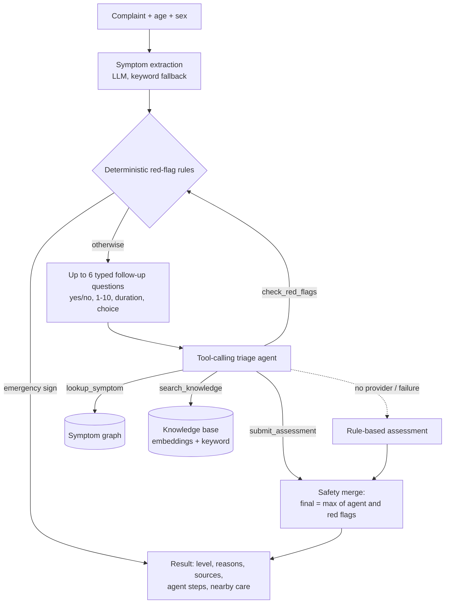

# HealthAI triage

Describe your symptoms in your own words and get one of three levels (**home care**, **see a doctor today**, or **emergency**), the reasons behind it, cited sources, and real places nearby to get care.

**Live:** https://healthai-triage.onrender.com · [Evals](https://healthai-triage.onrender.com/evals) · [Ops dashboard](https://healthai-triage.onrender.com/ops) · API docs at `https://healthai-triage-api.onrender.com/api/docs`

> Portfolio project, not a medical device. It can be wrong. In an emergency, call 112.

## How a case is decided



- **Red-flag rules** (`backend/services/red_flags.py`): plain regex rules for stroke (FAST), heart attack, breathing difficulty, anaphylaxis, meningitis, heavy bleeding, overdose, pregnancy bleeding, self-harm and more, plus answer-based rules ("chest pain → sweating: yes"). They ignore negated symptoms ("no chest pain") and **can only raise a level, never lower it**, so a model mistake can't talk the system out of an emergency. A self-harm crisis skips the AI entirely and shows helplines.
- **Agent** (`backend/services/agent.py`): an OpenAI-compatible tool-calling loop (Groq Llama 3.3 70B, failing over to NVIDIA NIM Llama 3.1 70B). It must finish with a structured `submit_assessment` call; citations it didn't actually retrieve are dropped. If no provider is configured or the agent fails, a rule-based assessment is used and the reason is shown.
- **Knowledge base / RAG** (`data/knowledge/`, `backend/services/rag.py`): 23 short notes (one per symptom plus emergency topics), each linked to a MedlinePlus page. Each section is embedded with [model2vec](https://github.com/MinishLab/model2vec) `potion-base-8M` (numpy only, ~30 MB) and searched with dense + keyword scoring.
- **Nearby care** (`backend/services/facilities.py`): real hospitals, clinics or pharmacies from OpenStreetMap (Overpass), nearest first; emergency departments first for emergencies.
- **Observability** (`backend/services/observability.py`): every model call (provider, latency, tokens, tool calls, errors, failover) and every finished check is logged; the Ops page reads it live.

There is no confidence percentage. The previous version showed a number drawn from `random.uniform(0.79, 0.89)`; the result page now shows the model's own probability estimate only when the agent made the call, labelled as such.

## Evals

`evals/cases.jsonl` holds 60 written cases, 20 per level, each with a rationale. Cases tagged `red_flag_*` contain textbook warning signs; cases tagged `judgement` are worded without them (for example "can't lift his right arm and his words are all jumbled") to test reasoning rather than keyword rules.

```bash
cd backend
python ../evals/run_eval.py --pipeline rules            # no API key needed
python ../evals/run_eval.py --pipeline agent            # needs GROQ_API_KEY
python ../evals/run_eval.py --pipeline agent --base-url https://healthai-triage-api.onrender.com --delay 2
```

The main metric is **missed emergencies** (an emergency told to stay home). Results are written to `evals/results/` and shown on the Evals page.

| Pipeline | Missed emergencies | Emergencies caught | Exact level | Under-triage | Over-triage |
|---|---|---|---|---|---|
| Rules only (AI off) | 2 (both `judgement` cases) | 85% (100% of red-flag cases) | 73% | 25% | 2% |

The expected labels were written by the author from public triage guidance and are **not clinically validated**.

CI (`.github/workflows/ci.yml`) runs the unit and API tests and the rules eval on every push, failing if any red-flag emergency is missed. When a `GROQ_API_KEY` secret is set it also runs the agent eval with a stricter gate (no missed emergencies at all, 90% emergency recall).

## Run locally

Requires Python 3.11 and Node 20.

```bash
# backend
cd backend
python -m venv .venv && source .venv/bin/activate
pip install -r requirements-dev.txt
python scripts/fetch_embedder.py          # downloads the 30 MB embedding model once
echo "GROQ_API_KEY=..." > .env            # optional; without it the rule-based path is used
uvicorn main:app --reload --port 8000

# frontend (proxies /api to :8000)
cd frontend && npm install && npm run dev
```

Tests: `cd backend && python -m pytest` (108 tests; the agent is tested with a scripted fake LLM, so no key is needed).

| Variable | Purpose |
|---|---|
| `GROQ_API_KEY`, `GROQ_MODEL` | Primary LLM (default `llama-3.3-70b-versatile`) |
| `NVIDIA_NIM_API_KEY`, `NVIDIA_NIM_MODEL` | Failover LLM |
| `DATABASE_URL` | Defaults to local SQLite |
| `SECRET_KEY` | Set a long random value in production |
| `VITE_API_URL` | Frontend build: backend origin when deployed separately |

## Deploy (Render)

- **API** (web service, Python 3.11): build `pip install -r backend/requirements.txt && python backend/scripts/fetch_embedder.py`, start `cd backend && uvicorn main:app --host 0.0.0.0 --port $PORT`.
- **Frontend** (static site): build `cd frontend && npm ci && npm run build`, publish `frontend/dist`, env `VITE_API_URL=<api url>`, and a rewrite rule `/*` → `/index.html` for client-side routes.

SQLite and the observability store live on the instance disk, so they reset on each deploy. Results are also kept in the visitor's browser (Your results page).

## Repository

```
backend/
  api/            triage, facilities, system (status, metrics, evals, knowledge)
  services/       agent, red_flags, answers, rag, facilities, llm_client, observability, nlp_engine, adaptive_engine
  tests/          pytest suite (fake LLM transport, no network)
data/             symptom graph + knowledge base notes
evals/            cases, harness, published results
frontend/         React + Vite
models/           offline Random Forest experiment (not used by the live app)
```

### Offline ML experiment

`models/train_classifier.py` trains a Random Forest on the Kaggle *Diseases and Symptoms* dataset (246,823 rows, 377 symptom features, 721 diseases): top-1 68.7%, top-3 79.0%, top-5 82.7% on a held-out split (`models/models/disease_model_metadata.json`). The trained model isn't shipped, and the live app doesn't use it.

Earlier planning notes from the pre-agent version are in `PROJECT_*.md`.

## License

This project is for educational and demo purposes only.
