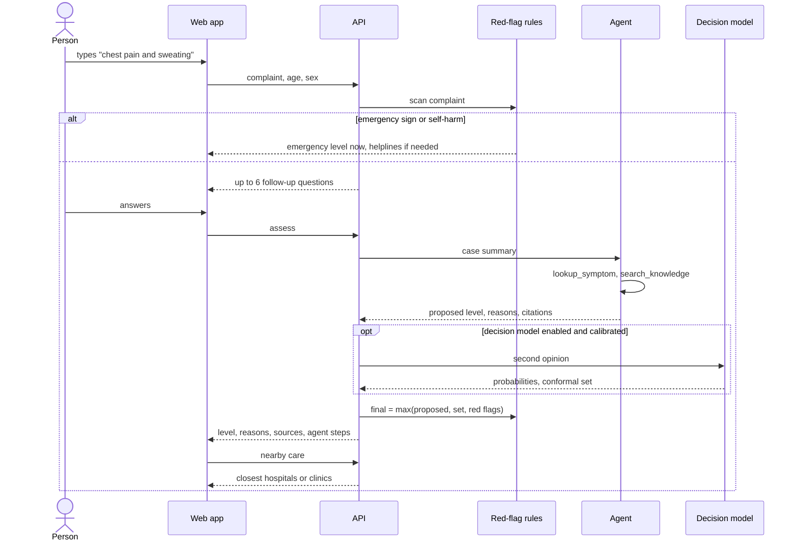
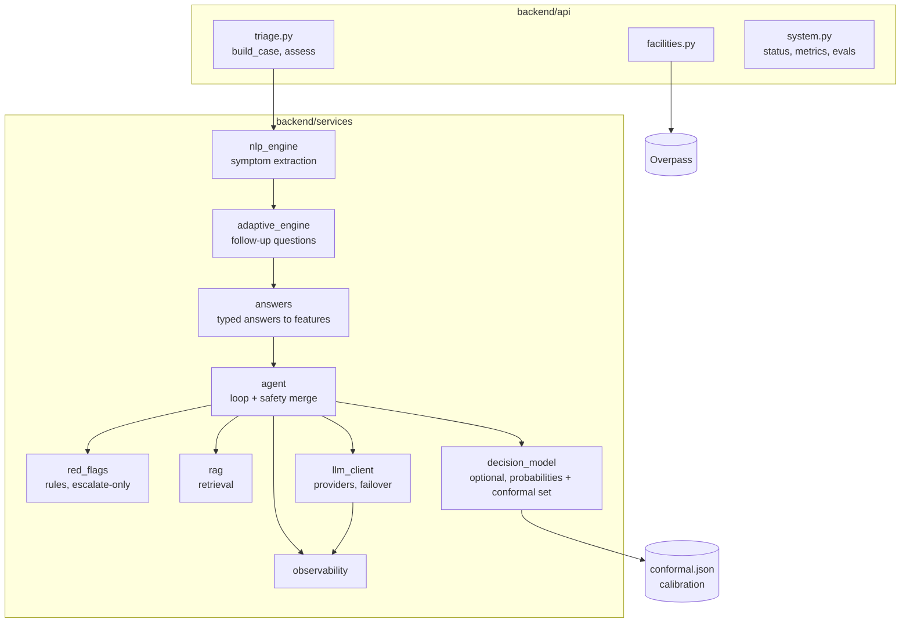
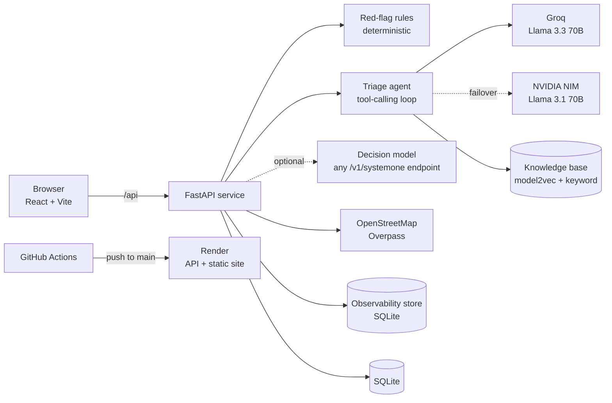

# HealthAI triage

**Describe your symptoms in your own words and get one of three levels (home care, see a doctor today, or emergency), the reasons behind it, cited sources, and real places nearby to get care.** The level comes from a tool-calling AI agent, but deterministic safety rules sit on top of it and can only raise the level, never lower it.

[](https://github.com/Asha0509/healthcare/actions/workflows/ci.yml)
[](https://github.com/Asha0509/healthcare/actions/workflows/quality.yml)
[](https://github.com/Asha0509/healthcare/actions/workflows/codeql.yml)
[](https://scorecard.dev/viewer/?uri=github.com/Asha0509/healthcare)

**Live:** https://healthai-triage.onrender.com · [Evals](https://healthai-triage.onrender.com/evals) · [Ops dashboard](https://healthai-triage.onrender.com/ops) · API docs at `https://healthai-triage-api.onrender.com/api/docs`

> Portfolio project, not a medical device. It can be wrong. In an emergency, call 112.

**Contents:** [Problem](#problem-statement) · [Solution](#solution) · [File structure](#file-structure) · [User flow](#user-flow) · [LLD](#low-level-design-lld) · [HLD](#high-level-design-hld) · [Scaling](#how-it-would-scale) · [USP](#usp-what-is-different-and-why-it-is-better) · [Tools](#tools-and-software-used) · [Principles](#principles-used) · [Requirements](#functional-and-non-functional-requirements) · [Results](#results) · [CI/CD](#engineering-quality-and-cicd) · [Run it](#run-it) · [Limits](#limits)

## Problem statement

Someone with chest tightness at 2 a.m. has three options: search the web and read a list of frightening possibilities, wait until morning, or go to the hospital. Symptom checkers promise to help, but most fail in one of two ways:

- **They are confidently wrong.** A number like "87% match" with nothing behind it, or a language model that talks itself out of an emergency.
- **They can't be checked.** There is no way to see why a level was chosen, or what it was based on.

The product requirement is therefore narrow and strict:

1. **Never talk anyone out of an emergency.** A missed emergency is the failure that matters most, so it is the headline metric.
2. **Show the reasoning and the sources**, so the answer can be checked rather than trusted.
3. **Say plainly when the AI isn't involved.** If no model is available the system falls back to rules and says so; it never invents a confidence number.

## Solution

HealthAI triage turns a free-text complaint into one of three levels with the reasoning attached.

1. **Understand.** The complaint, age and sex are parsed into symptoms (LLM, with a keyword fallback).
2. **Check the floor first.** Deterministic red-flag rules scan the text. A textbook emergency sign (stroke, heart attack, anaphylaxis and so on) sets the level immediately; a self-harm crisis skips the AI and shows helplines.
3. **Ask only what matters.** Up to six typed follow-up questions (yes/no, 1-10, duration, choice) are chosen from the symptom graph, and the answers are validated.
4. **Reason with tools.** A tool-calling agent looks up the symptom graph, searches a curated knowledge base (RAG over MedlinePlus-linked notes) and re-checks the red flags before it submits a structured assessment.
5. **Optionally get a second opinion.** A decision model (hosted or local) can return level probabilities; a conformal prediction set turns them into a set of levels the model cannot rule out, and the case is raised if that set holds a more urgent level.
6. **Merge safely.** The final level is the highest of the agent, the second opinion and the red-flag rules. Nothing can lower a level.
7. **Show everything.** The result gives the level, reasons, citations that were actually retrieved, every agent step, and real nearby hospitals or clinics from OpenStreetMap. Every model call and finished check is logged for the Ops page.

If no model is available, the system falls back to the rule-based assessment and says so on screen. It never invents a confidence number.

## File structure

```
.github/workflows/   ci.yml (tests + safety eval gates), quality.yml (vulture, xenon, jscpd), codeql.yml, scorecard.yml; dependabot.yml
api/index.py         Vercel serverless entry that exposes the FastAPI app
render.yaml          Render blueprint: API + static site, deploy only after checks pass
vercel.json          Vercel build and rewrite config (alternative host)
ruff.toml            One lint config for the repo
scripts/validate.sh  One-command validation: lint, tests, safety eval, frontend build
requirements.txt     Root requirements for the serverless entry

backend/
  main.py            FastAPI app: routers, CORS, startup (database + observability)
  api/
    triage.py        Triage endpoints: start, answer, assess, result, history
    facilities.py    Nearby care for a triage level
    system.py        Status, observability metrics, eval results, knowledge-base listing
  services/
    nlp_engine.py        Symptom extraction from free text (LLM with keyword fallback)
    adaptive_engine.py   Chooses the next follow-up question from the symptom graph
    answers.py           Validates and normalises typed answers into features
    patient_context.py   Age, sex and history context used when reasoning
    red_flags.py         Deterministic emergency rules; can only raise a level
    agent.py             Tool-calling triage loop, rule-based fallback and the safety merge
    rag.py               Hybrid retrieval (dense + keyword) over data/knowledge
    llm_client.py        Shared OpenAI-compatible client with provider failover
    decision_model.py    Optional second opinion plus split conformal prediction sets
    facilities.py        Overpass queries for hospitals, clinics, pharmacies
    observability.py     SQLite store for every model call and every finished check
  schemas/models.py      Pydantic request and response models
  core/                  config (env settings), logging, security helpers
  db/                    database setup; schema.sql (Postgres) and schema_sqlite.sql
  scripts/fetch_embedder.py   Downloads the 30 MB embedding model at build time
  tests/                 133 tests, fake LLM transport, no network (agent, rules, RAG, answers, API, decision model, facilities, observability, NLP)

data/
  symptom_disease_graph.json   Symptom graph used for lookup and follow-up questions
  knowledge/                   23 short notes, one per symptom or emergency topic, each linked to MedlinePlus

evals/
  cases.jsonl        60 written cases (20 per level) with a rationale each
  run_eval.py        Eval harness with safety gates (rules or agent pipeline)
  decision_eval.py   Calibrates and evaluates the optional decision model
  results/           Published eval output shown on the Evals page

frontend/src/
  App.jsx, main.jsx, index.css     Routes and global styles
  pages/    Landing (intro), Triage (intake + questions), Result (level, reasons, steps, care), History (past results), Evals, Ops
  components/  TriageTag, IntakeFields, AnswerInput (a control per question type), AgentTrace, Citations, Facilities, Navbar, Footer
  api/client.js, lib/history.js (browser-only history), lib/labels.js (level names and meaning)

models/   Offline Random Forest experiment on a public disease dataset; not used by the live app
PROJECT_*.md   Planning notes from the pre-agent version
```

## User flow



**Explanation.** The person types a complaint and basic details. The red-flag rules run before any model, so an emergency or a self-harm crisis is answered at once. Otherwise the app asks a few typed questions, the agent reasons with tools, and the optional second opinion can only raise the level. A final safety merge takes the maximum of all signals, then the app fetches nearby care for that level. The history of results stays in the browser.

## Low-level design (LLD)



**Explanation.** `api/triage.py` is thin: it builds the case and calls services in a fixed order. `nlp_engine` extracts symptoms, `adaptive_engine` picks questions, and `answers` converts typed replies into features. `agent` owns the tool loop and the final merge; it calls `llm_client` (providers and failover), `rag` (knowledge search), `red_flags` (the floor) and, optionally, `decision_model`. `observability` records every model call and run. Every model-dependent piece has a non-model fallback, so a failure reduces detail, not safety.

### How a case is decided

- **Red-flag rules** (`backend/services/red_flags.py`): regex rules for stroke (FAST), heart attack, breathing difficulty, anaphylaxis, meningitis, heavy bleeding, overdose, pregnancy bleeding, self-harm and more, plus answer-based rules ("chest pain, then sweating: yes"). They ignore negated symptoms ("no chest pain") and **can only raise a level.** A self-harm crisis skips the AI and shows helplines.
- **Agent** (`backend/services/agent.py`): an OpenAI-compatible tool-calling loop. Tools: `lookup_symptom`, `search_knowledge`, `check_red_flags`, and a final `submit_assessment`. Citations the agent did not actually retrieve are dropped. If no provider is configured or the agent fails, a rule-based assessment is used and the reason is shown.
- **Knowledge base** (`data/knowledge/`, `backend/services/rag.py`): 23 short notes, each linked to a MedlinePlus page, split by section, embedded with model2vec and searched with dense plus keyword scoring.
- **Safety merge:** the final level is the highest of the agent, the second opinion and the red-flag rules. Nothing in the pipeline can lower a level.
- **Nearby care** (`backend/services/facilities.py`): real facilities from OpenStreetMap, emergency departments first for emergencies.
- **Observability** (`backend/services/observability.py`): every model call (provider, latency, tokens, tool calls, errors, failover) and every finished check is logged; the Ops page reads it live.

### The second opinion: an optional decision model

Off by default (`DECISION_MODEL=off`). When switched on, a separate model returns a probability for each of the three levels for the same case. A **split conformal prediction** step turns that into a set of levels that contains the right one with probability at least 1 - alpha (on exchangeable cases). If the set contains a more urgent level than the current answer, the result is raised to it. It is never lowered.

- **Any compatible endpoint works.** `backend/services/decision_model.py` sends a typed request to `POST {SYSTEMONE_URL}/v1/systemone` and reads back `{"probabilities": {...}}`. That fits a hosted decision model (such as TypeSafe's Jev) or an open-weights one served locally (such as Laya through `laya-serve`). Nothing is bundled and no vendor is required.
- **No calibration, no escalation.** The coverage guarantee needs a calibration quantile. Without `backend/models/conformal.json` the opinion is shown for information only and cannot change a level.
- **Calibrate with your own endpoint:** `python evals/decision_eval.py --url <endpoint> --write-calibration` queries all 60 cases, writes the quantile, and reports top-1 accuracy, under-triage, leave-one-out coverage and mean set size to `evals/results/decision.json`.
- **Failures are silent to the patient:** timeouts, bad JSON or an unreachable server mean no second opinion, and triage carries on.
- **Skipped for self-harm crises**, which go straight to helplines.

Why conformal: it gives a coverage guarantee that does not rely on the model being well calibrated. With 60 calibration cases the quantile is coarse, so treat it as a demonstration of the method.
## High-level design (HLD)



**Explanation.** A React single-page app talks to one stateless FastAPI service. The service owns the deterministic rules, the agent, the knowledge base and the optional decision model, and reaches out to two LLM providers (with failover), OpenStreetMap, and SQLite for app data and observability. Pushes to `main` pass GitHub Actions and then deploy to Render.

## How it would scale

| Concern | Today | Next step |
|---|---|---|
| API | One stateless FastAPI instance | Run N instances behind a load balancer; nothing in the process is shared except SQLite |
| Storage | SQLite on the instance disk (resets on deploy) | Postgres (`schema.sql` is already written); keep observability in a separate store |
| Model calls | Synchronous with provider failover | A queue and per-provider rate limiting; response caching for repeated complaints; a third provider |
| Retrieval | 24 notes, in-memory embeddings | A vector store once the knowledge base grows past a few thousand passages; scheduled content review |
| Nearby care | Live Overpass query per request | Cache by area; fall back to a second place source |
| Quality | 60 author-written cases | A larger set labelled by clinicians, re-run on every change, with the decision model calibrated on it |
| Observability | SQLite plus an Ops page | Export traces and metrics to a standard collector and alert on missed-emergency and error-rate changes |
| Reach | English | Multilingual intake and local emergency numbers per region |

## USP: what is different and why it is better

| Feature | What most symptom checkers do | What this does |
|---|---|---|
| Safety | Let the model decide, or show a score | Deterministic red-flag rules sit under everything and can only raise a level. A model mistake cannot talk the system out of an emergency |
| Honesty about confidence | A percentage with nothing behind it (the earlier version of this project did too) | No made-up number. A probability appears only when a model produced it, labelled as such; the optional second opinion uses conformal sets with a stated error rate |
| Explainability | A level and nothing else | Reasons, citations the agent actually retrieved (others are dropped), and every agent step on the result page |
| Missing AI | Break or guess | Falls back to rules and says so on screen |
| Evidence of quality | Marketing claims | A 60-case eval with missed emergencies as the headline metric, gated in CI, and a "what did not work" section |
| Real-world next step | Advice only | Nearest real hospitals, clinics or pharmacies, emergency departments first for emergencies |
| Operations | A black box | An Ops page with latency, tokens, tool calls, errors and failover for every model call |
| Privacy | Account required | No account; past results stay in the visitor's browser |
| Vendor lock-in | One model | Two LLM providers with failover, and a vendor-neutral decision-model endpoint (`/v1/systemone`) that can be hosted or local |

## Tools and software used

| Tool | What it does here | Why this and not something else |
|---|---|---|
| FastAPI, Pydantic | API and request/response schemas | Typed validation at the edge; automatic API docs |
| React, Vite | Front end | Small, fast build; no server rendering needed |
| Groq (Llama 3.3 70B) | Agent model | Fast, free tier; supports tool calling through an OpenAI-compatible API |
| NVIDIA NIM (Llama 3.1 70B) | Failover model | A second provider so one outage doesn't stop the agent |
| Deterministic regex rules | Red flags | A safety floor that cannot hallucinate and can be read line by line |
| model2vec `potion-base-8M` | Embeddings for retrieval | numpy only, ~30 MB, no PyTorch, so it fits a small server |
| Conformal prediction | Coverage-guaranteed label sets | Distribution-free guarantee; a few lines of plain Python |
| Decision model via `/v1/systemone` (optional) | Second opinion | Typed probability output that can only raise a level; vendor-neutral, so a hosted or local model can be plugged in |
| OpenStreetMap Overpass | Nearby care | Free, real data |
| SQLite | App data and observability | No extra service to run for a demo |
| pytest, ruff, vulture, jscpd | Tests, lint, dead code, duplication | Fast feedback; one config per repo |
| GitHub Actions, CodeQL, Scorecard, Dependabot | CI/CD and supply-chain checks | Everything is checked on every push |
| Render | Hosting | Deploys the API and static site straight from the repo |

## Principles used

* **Safety first, escalate only.** Every safety layer (rules, agent merge, second opinion) can raise a level and none can lower it.
* **Deterministic where it must be right, models where judgement helps.** Emergency rules are plain regex; the LLM handles language and borderline reasoning.
* **Fail soft.** Provider failure, timeouts and bad JSON degrade to the rule-based path with a visible reason.
* **Show the work.** Reasons, retrieved sources and agent steps are part of the response, not hidden logs.
* **No claim without a measurement.** Numbers come from the eval harness; unmeasured things (agent accuracy, decision-model coverage) are stated as unmeasured.
* **Separation of concerns.** Thin API layer, single-purpose services, typed schemas, config only in `core/config.py`.
* **Test without the network.** A scripted fake LLM transport makes agent behaviour reproducible in CI.
* **Least data.** No accounts; history is local to the browser; secrets only in environment settings.

## Functional and non-functional requirements

**Functional**

| Requirement | How it is implemented |
|---|---|
| Accept a free-text complaint with age and sex | `IntakeFields` + `POST /triage/start` (or `/triage/assess` for a single call), validated by Pydantic |
| Detect emergencies immediately | `red_flags.py` regex rules, negation-aware, run before any model |
| Ask relevant follow-ups | `adaptive_engine` over the symptom graph; `answers.py` validates typed answers |
| Produce a three-level result with reasons and sources | `agent.py` tool loop with RAG; unretrieved citations dropped |
| Work without an AI provider | Rule-based assessment fallback with the reason shown |
| Find care nearby | `facilities.py` against OpenStreetMap, emergency departments first |
| Keep a history of results | Browser-local `lib/history.js` (the server also keeps session records) |
| Publish quality evidence | `evals/` harness, Evals page |

**Non-functional**

| Quality | Target | How it is implemented and checked |
|---|---|---|
| Safety | No missed red-flag emergency | Escalate-only merge; CI fails on any missed red-flag emergency; agent eval gates on zero missed emergencies when a key is set |
| Reliability | Survives provider failure | Groq to NVIDIA NIM failover, rule-based fallback, silent failure of the optional second opinion |
| Observability | Every model call traceable | `observability.py` stores provider, latency, tokens, tool calls, errors and failover; Ops page |
| Testability | Reproducible without network | 133 tests with a fake LLM transport; conformal maths tested directly |
| Maintainability | Small, clean code | ruff (lint), vulture (dead code), xenon/radon (complexity), jscpd (copy-paste) on every push. `assess()` in `agent.py` is the known long function. A Ponytail minimal-code review pass is planned and has not been run on this repo yet |
| Security | No secrets in code, known-issue scanning | Keys in environment only; CodeQL, OpenSSF Scorecard, Dependabot |
| Performance | Fits a small server | numpy-only embeddings (~30 MB, no PyTorch); no heavy model in the API process |
| Privacy | No account | Results are kept in the browser; the server stores only the case record (no account, no name) |
| Portability | Runs anywhere Python 3.11 and Node 20 do | Render blueprint, Vercel config, local `uvicorn` |

## Results

All numbers come from 60 hand-written cases (20 per level) in `evals/cases.jsonl`, run with `evals/run_eval.py`, and are re-run in CI. The labels were written by the author from public triage guidance and are **not clinically validated**. Sixty cases is enough to catch regressions and compare designs, not to claim clinical accuracy.

| Pipeline | Missed emergencies | Emergencies caught | Exact level | Under-triage | Over-triage |
|---|---|---|---|---|---|
| Rules only (no AI) | 2 (both `judgement` cases) | 85% (100% of red-flag cases) | 73% | 25% | 2% |

The two misses are cases worded without textbook warning signs ("can't lift his right arm and his words are all jumbled"). Catching those is the job of the agent, which is why the agent eval gates on zero missed emergencies.

The agent (LLM) pipeline is evaluated with `run_eval.py --pipeline agent` and gated in CI when a model key is configured (no missed emergencies, 90% emergency recall). Those numbers are added to the Evals page once the key runs in the deployed environment; none are claimed here until they are measured.

**What did not work, reported rather than hidden:**

- **Rules alone miss judgement cases.** Two of 20 emergencies are told to stay home without the agent. This is the gap the agent exists to close, and the reason the agent eval is gated.
- **The optional decision model has not been evaluated in this repository.** The code, the conformal procedure and tests exist (see below), but no model endpoint was run against the 60 cases here, so no accuracy or coverage figure is claimed. Earlier experiments with a small distilled student found it too weak to use on its own; that work is not part of this code.
- The earlier version showed a confidence percentage drawn from `random.uniform(0.79, 0.89)`. It was removed; the page now shows a probability only when a model produced one, labelled as such.

## Engineering quality and CI/CD

| Workflow | Runs | Gate |
|---|---|---|
| `ci.yml` | ruff, backend tests (133), rules eval, front-end build; agent eval when a model key secret exists | Fails on any missed red-flag emergency; the agent eval additionally requires zero missed emergencies and 90% emergency recall. Eval metrics are written to the run summary |
| `quality.yml` | vulture, complexity report and gate (radon/xenon), copy-paste detection (jscpd) | Dead code and extreme complexity fail the build. `assess()` in `agent.py` is the one long orchestrator and is flagged for splitting |
| `codeql.yml` | CodeQL for Python and JavaScript | Weekly and on every push |
| `scorecard.yml` | OpenSSF Scorecard | Weekly |
| Dependabot | pip, npm and Actions updates | Weekly pull requests |

The API and the static site are deployed from `main` on Render. Tests use a scripted fake LLM transport, so CI never calls a model unless a key secret is set.

### Validate and deploy

`scripts/validate.sh` runs the whole pipeline in order and prints a pass/fail line per stage: lint, unit and API tests, the safety eval (gated on missed emergencies), the agent eval when `GROQ_API_KEY` is set, and the frontend build. These are the checks CI runs, so a green local run predicts a green build.

`render.yaml` is a Render blueprint with `autoDeployTrigger: checksPass`: a push to `main` deploys only after the GitHub checks pass. Secrets are declared with `sync: false` and entered in the Render dashboard, never committed.

## Run it

Requires Python 3.11 and Node 20.

```bash
# backend
cd backend
python -m venv .venv && source .venv/bin/activate
pip install -r requirements-dev.txt
python scripts/fetch_embedder.py          # downloads the 30 MB embedding model once
echo "GROQ_API_KEY=..." > .env            # optional; without it the rule-based path is used
uvicorn main:app --reload --port 8000

# frontend (proxies /api to :8000)
cd frontend && npm install && npm run dev
```

Tests: `cd backend && python -m pytest`. Evals: `python evals/run_eval.py --pipeline rules`. Calibrating an optional decision model: `python evals/decision_eval.py --url <endpoint> --write-calibration`.

| Variable | Purpose |
|---|---|
| `GROQ_API_KEY`, `GROQ_MODEL` | Primary LLM (default `openai/gpt-oss-120b`) |
| `NVIDIA_NIM_API_KEY`, `NVIDIA_NIM_MODEL` | Failover LLM |
| `DECISION_MODEL` | `off` (default) or `systemone` |
| `SYSTEMONE_URL`, `SYSTEMONE_MODEL`, `SYSTEMONE_API_KEY`, `SYSTEMONE_TIMEOUT` | The decision-model endpoint (a local server needs no key) |
| `CONFORMAL_PATH` | Calibration file; defaults to `backend/models/conformal.json` |
| `DATABASE_URL` | Defaults to local SQLite |
| `SECRET_KEY` | Set a long random value in production |
| `VITE_API_URL` | Front end build: backend origin when deployed separately |

Keys live in `.env` locally and in the host's environment settings when deployed; they are never committed.

## Limits

- Labels are author-written, 60 cases, not clinically validated. This is a demonstration of method, not a medical device.
- The agent pipeline has not been scored in this repository yet; its numbers appear on the Evals page once a model key runs the eval.
- The decision model is optional and unevaluated here; see "What did not work".
- SQLite and the observability store live on the instance disk, so they reset on each deploy. Results are also kept in the visitor's browser (Your results page).

## License

MIT
